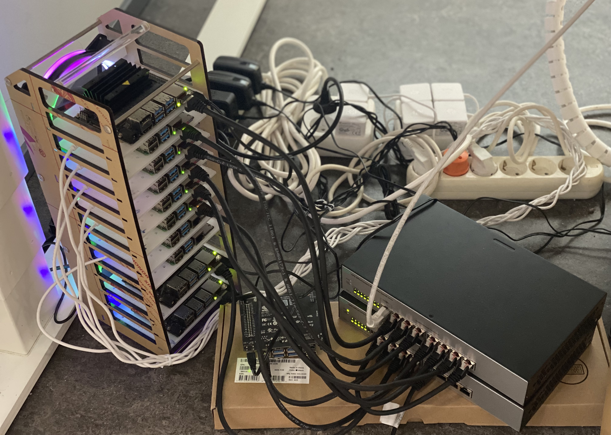

# Elastic Machine Learning Serving across edge-cloud environment

This project contains information about setup experiment for edge-cloud ML serving
## System deployment
- OS: 
  - Ubuntu 21.04 for Raspberry Pi could be found [here](https://ubuntu.com/download/raspberry-pi/thank-you?version=21.04&architecture=server-arm64+raspi)
  - Ubuntu (default [image](https://developer.nvidia.com/jetson-nano-sd-card-image))

<p align = "center">

</p>
<p align = "center">
Fig.1 - Edge Cluster - Raspberry Pi & Jetson Boards
</p>

- Install Docker and other packages `system_setup/setup.sh`
## Edge Kubernetes
### K3s Deployment
- Cluster setup is described [here](https://version.aalto.fi/gitlab/aaltosea/edge-ai-testbeds/-/tree/master/Rasp-k3s)
### Application/Service Deployment
  - Categorize resouces (nodes) with different features using [label](https://kubernetes.io/docs/concepts/overview/working-with-objects/labels/)  
    - CPU
    - Memory
    - GPU
    - Other specifications
  - Assign pods/services using [node selector](https://kubernetes.io/docs/concepts/scheduling-eviction/assign-pod-node/)

```sh
$ sudo kubectl label nodes <node-name> <label-key>=<label-value>
```
  - Add the `nodeSelector`in any config file, for example:

```yaml
apiVersion: v1
kind: Pod
metadata:
  name: nginx
  labels:
    env: test
spec:
  containers:
  - name: nginx
    image: nginx
    imagePullPolicy: IfNotPresent
  nodeSelector:
    disktype: ssd
```
  - Other methods: 
    - interlude: built-in node lable
    - Node isolation/restriction
    - Affinity and anti-affinity

