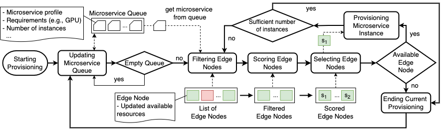

# ROHE

---

[](https://rdsea.github.io/ROHE/)


[](https://github.com/astral-sh/ruff)

[](https://opensource.org/licenses/Apache-2.0)

## High-level view

<figure>
<p style="text-align:center">

</p>
<figcaption>
<p style="text-align:center">
Fig. ROHE High-level View
</p>
</figcaption>
</figure>

## 1. Observation Service

### 1.1 User Guide

- Prerequisite: before using Observation Agent, users need:
  - Database service (e.g., MongoDB)
  - Communication service (e.g., AMQP message broker)
  - Container environment (e.g., Docker)
  - Visualization service (e.g., Prometheus, Graphana - optional)
- Observation Service includes registration service and agent manager. Users can modify Observation Service configurations in `$ROHE_PATH/config/observationConfigLocal.yaml`.
  The configuration defines: - Protocols with default configurations for public (connector) and consume (collector) metrics. - Database configuration where metrics and application data/metadata are stored. - Container Image of the Observation Agent - Logging Level (debugging, warning, etc)
- To deploy Observation Service, navigate to `$ROHE_PATH/bin`.

```bash
$ ./start_obervation_service.sh
```

- Application Registration
  - Users can register the application using `rohe_cli` in the `/bin` folder. Application metadata and related configurations will be saved to the Database
  - When register an end-to-end ML application, the users must provide application name (`app_name` - string), run ID (`run_id` - string), user ID (`user_id` - string), and send registration request to the Observation Service via its `url`.
  - The Observation Service will generate:
  - Application ID: `appID`
  - Database name: `db` for saving metric reports in runtime
  - Qoa configuration: `qoa_config` for reporting metrics

Example

```bash
$ rohe_cli register-app --app <application_name> --run <run_ID> --user <user_ID> --url <resigstration_service_url> --output_dir <folder_path_to_save_app_metadata>
```

- Then, users must implement QoA probes manually into the application. Probes use this metadata to register with the observation service. The metadata can be extended with information like stage_id microserviceID, method, role, etc. After the registration, the probes will receive communication protocol & configurations to report metrics.
- While the applications are running, the reported metrics are processed by an Observation Agent.
  The Agent must be configured with application name, command, stream configuration including: - Processing window: interval, size - Processing module: specify `parser` and `function` names to process metric reports.
  User must define these processing moduled in `$ROHE_PATH/userModule` (e.g., `userModule/common`), including metric `parser` for parsing metric reports and `function` for window processing.

- To start the Agent, the user can use `rohe_cli`:

```bash
$ rohe_cli start-obsagent --app <application_name> --conf <path_to_agent_configuration> --url <resigstration_service_url>
```

- The Observation service will start the Agent on a container (e.g., Docker container). Metric processing results from the Agent are saved to files or database or message broker (developing) or Prometheus/Grafana (developing) depending on Agent configuration

- To stop the Agent, the user can also use `rohe_cli`:

```bash
$ rohe_cli stop-obsagent --app <application_name> --conf <path_to_agent_configuration> --url <resigstration_service_url>
```

- To delete/unregister an application using `rohe_cli`:

```bash
$ rohe_cli delete-app --app <application_name> --url <resigstration_service_url>
```

### 1.2 Development Guide

#### 1.2.1 Registration Service

- This service allows users to register and unregister applications. Service receives commands from REST, developer can modify `core.observation.restService` module to support more commands for editing/updating application.
- Currently this service supports MongoDB as database and AMPQ as communication protocol. The service will also support other communication protocols and databases

#### 1.2.2 Observation Agent

- Agents are currently deployed on the local docker environment: `core.observation.containerizedAgent`.
- To Do: implement remote deployment on several container environments (Docker, Kubernetes, etc).

## 2. Orchestration Service

### 2.1 User Guide

- Prerequisite: before using Orchestration Service, users need:
  - Database service (e.g., MongoDB)
- The Orchestration Service allocate service instances on edge nodes base on a specific orchestration algorithm (currently using scoring algorithm). Users can modify Orchestration Service configurations in `$ROHE_PATH/config/orchestrationConfigLocal.yaml`.
  The configuration defines: - Database configuration where metrics and application data/metadata are stored. - Service queue priority - Orchestration algorithm
- To deploy Orchestration Service, navigate to `$ROHE_PATH/bin`.

```bash
$ ./start_orchestration_service.sh
```

- Add nodes to the orchestration system
  - Users can add nodes by using `rohe_cli` in the `/bin` folder. The node metadata will be saved to the Database
  - When adding nodes, the users must provide file path to the node configurations (`-conf`) and `-url`, the url to the Orchestration Service.
  - The template of node configuration is in `$ROHE_PATH/templates/orchestration_command/add_node.yaml`

Example

```bash
$ rohe_cli add-node --app <application_name> --conf <configuration_path> --url <orchestration_service_url>
```

- Add service to the orchestration system
  - Users can add services by using `rohe_cli` in the `/bin` folder. The service metadata will be saved to the Database
  - When adding service, the users must provide file path to the service configurations (`-conf`) and `-url`, the url to the Orchestration Service.
  - The template of service configuration is in `$ROHE_PATH/templates/orchestration_command/add_service.yaml`

Example

```bash
$ rohe_cli add-service --app <application_name> --conf <configuration_path> --url <orchestration_service_url>
```

- Get node information from the orchestration system
  - Users can get node information by using `rohe_cli` in the `/bin` folder.
  - To get node information, the users must provide file path to the get command (`-conf`) and `-url`, the url to the Orchestration Service.
  - The template of command is in `$ROHE_PATH/templates/orchestration_command/get_node.yaml`

Example

```bash
$ rohe_cli get-node --app <application_name> --conf <configuration_path> --url <orchestration_service_url>
```

- Get service information from the orchestration system
  - Users can get service information by using `rohe_cli` in the `/bin` folder.
  - To get service information, the users must provide file path to the get command (`-conf`) and `-url`, the url to the Orchestration Service.
  - The template of command is in `$ROHE_PATH/templates/orchestration_command/get_service.yaml`

Example

```bash
$ rohe_cli get-service --app <application_name> --conf <configuration_path> --url <orchestration_service_url>
```

- Remove nodes from the orchestration system
  - Users can remove node by using `rohe_cli` in the `/bin` folder.
  - To remove nodes, the users must provide file path to the get command (`-conf`) and `-url`, the url to the Orchestration Service.
  - The template of command is in `$ROHE_PATH/templates/orchestration_command/remove_node.yaml`

Example

```bash
$ rohe_cli remove-node --app <application_name> --conf <configuration_path> --url <orchestration_service_url>
```

- Start Orchestration Agent
  - Users can start the agent by using `rohe_cli` in the `/bin` folder.
  - Users must provide file path to the get command (`-conf`) and `-url`, the url to the Orchestration Service.
  - The agent constantly check services in the service queue (for services waiting for being allocated). If the service queue is not empty, the agent will find location for allocate the service in the available nodes.
  - The template of command is in `$ROHE_PATH/templates/orchestration_command/start_orchestration.yaml`

Example

```bash
$ rohe_cli start-orchagent --app <application_name> --conf <configuration_path> --url <orchestration_service_url>
```

- Stop Orchestration Agent
  - Users can start the agent by using `rohe_cli` in the `/bin` folder.
  - Users must provide file path to the get command (`-conf`) and `-url`, the url to the Orchestration Service.
  - The template of command is in `$ROHE_PATH/templates/orchestration_command/stop_orchestration.yaml`

```bash
$ rohe_cli stop-orchagent --app <application_name> --conf <configuration_path> --url <orchestration_service_url>
```

### 2.2 Development Guide

#### 2.2.1 Resource Management

The module provide the abstract class/object to manage the infrastructure resource by Node; application by Deployment; network routine by Service; and eviroment variable by ConfigMap.

- Node: physical node
- Deployment: each application has multiple microservices. Each microservice has its own Deployment setup specify: image, resource requirement, replicas, etc
- Microservice: each microservice is advertised with a microservice name within K3s network so that other microservices can communicate with it.
- ConfigMap: provide initial environment variable for docker containers of each deployment when starting.
- resource: provide abstract, high-level class to manage resources (Microservice Queue and Node Collection).

#### 2.2.2 Deployment Management

- Provide utilities for generating deployment files from template (`$ROHE_PATH/templates/deployment_template.yaml`)
- Deploy microservices, pod based on generated deployment files
- TO DO: develop abstract function to improve the extendability

#### 2.2.3 Algorithm

This module provide functions to select resource to allocate microservices.

Current implementation: Scoring Algorithm

- Input:

  - Microservice from a microservice Queue (queue of microservice need to be allocated), each microservice in the queue include
    - the number of instances (replicas/scales)
    - CPU requirement (array of CPU requirements on every CPU core). Example: [100,50,50,50] - the microservice use 4 CPUs with 100, 50, 50, and 50 millicpu on each core respectively.
    - Memory requirement (rss, vms - MByte)
    - Accelerator requirement (GPU - %)
    - Sensitivity: 0 - Not sensitive; 1 - CPU sensitive; 2 - Memory sensitive; 3 CPU & Memory sensitive
    - Other metadata: microservice name, ID, status, node (existing deployment), running (existing running instance), container image, ports configuration

  Example:

  ```json
  {
      "EW:VE:TW:WQ:01":{
          "microservice_name":"object_detection_web_service",
          "node": {},
          "status": "queueing",
          "instance_ids": [],
          "running": 0,
          "image": "rdsea/od_web:2.0",
          "ports": [4002],
          "port_mapping": [{
              "con_port": 4002,
              "phy_port": 4002
          },{
              "con_port": 4003,
              "phy_port": 4003
          }],
          "cpu": 550,
          "accelerator": {
              "gpu": 0
          },
          "memory": {
              "rss": 200,
              "vms": 500
          },
          "processor": [500,50],
          "sensitivity": 0,
          "replicas": 2
  }
  ```

  - Node Collection: list of available nodes for allocating microservices each node includes information of capacity and used resources:
    - CPU (millicpu)
    - Memory (rss, vms - MByte)
    - Accelerator (GPU - %)

  Example

  ```json
  "node1":{
      "node_name":"RaspberryPi_01",
      "MAC":"82:ae:30:11:38:01",
      "status": "running",
      "frequency": 1.5,
      "accelerator":{},
      "cpu": {
          "capacity": 4000,
          "used": 0
      },
      "memory": {
          "capacity": {
              "rss": 4096,
              "vms": 4096
          },
          "used": {
              "rss": 0,
              "vms": 0
          }
      },
      "processor": {
          "capacity": [1000,1000,1000,1000],
          "used": [0,0,0,0]
      }
  }, ...
  ```

Workflow of Scoring Algorithm:


- Updating Microservice Queue
- Filtering Nodes from the Node Collection
- Scoring filtered node
- Selecting node based on the score, applying different strategies: first/best/worst-fit

- TO DO: define abstract function for each module

## 3 Running Example

### 3.1 Object Classification

<!-- ### User running pipeline
Assume user has application
Explain:
- application: meaning
- client: meaning
- ...


### Scenario 1: obsersvation
Step 1:
- Register application: one time
    - template file for register: example
    - Run client_registrate -> url: "observation:register/"
    return: qoa4ml config

Step 2:
- Enable monitoring: one time
    - Config qoa4ml client using qoa4ml config: example
    - Run: qoa4ml_configurate -> generate qoa4ml client config

Step 3:
- Start observation agent
    - Set function and parser for agent in configuration.json: example: niiStream.config
    - Run start_agent: example: startAgent.sh -> python

Step 4
- Get analysis result from agent:
    - get data from mogodb

### Scenario 2: orchestration
### Scenario 3: ...

Add example contract to 'example/contract'

rename module for icsoc, journal

### Scenario 4: user modify pipeline to use ROHE


 -->

## Reference

If you use the software, you can cite

```
@software{site:rohe,
author = {Minh-Tri Nguyen and Hong-Linh Truong},
license = {Apache-2.0},
month = Dec,
title = {{ROHE: An Orchestration Framework for End-to-End Machine Learning Serving with Resource Optimization on Heterogeneous Edge}},
url = {https://github.com/rdsea/ROHE},
year = {2023}
}
```

## Authors/Contributors

- Minh-Tri Nguyen
- Hong-Linh Truong
- Vuong Nguyen
- Anh-Dung Nguyen

## License

[Apache License](./LICENSE)
