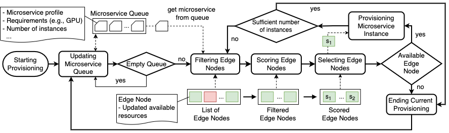

# ROHE
---

[](https://rdsea.github.io/ROHE/)


[](https://github.com/astral-sh/ruff)

[](https://opensource.org/licenses/Apache-2.0)


---

ROHE is a platform for orchestrating end-to-end machine learning inference pipelines on heterogeneous edge clusters. It provides quality-aware orchestration, runtime observation, and contract-driven SLA enforcement.

Features:

- [Resource Optimization](src/rohe/orchestration/resource_management/): ROHE selects the optimal edge nodes for deploying microservices in ML pipelines based on resource requirements and availability. It also allows developers to implement their own resource allocation algorithms. Currently, ROHE supports application deployments on Kube-like environment (e.g., K3s and K8s). Publication: [On Optimizing Resources for Real-Time End-to-End Machine Learning in Heterogeneous Edges](https://onlinelibrary.wiley.com/doi/full/10.1002/spe.3383)
- [Observation Service](src/rohe/observation/): ROHE provides a service for monitoring and analyzing the performance of ML pipelines. It allows developers to register their applications, configure observation agents, collect metrics from running applications, and support runtime explainability. Publication: [Novel contract-based runtime explainability framework for end-to-end ensemble machine learning serving](https://ieeexplore.ieee.org/stamp/stamp.jsp?arnumber=10555921), [Security orchestration with explainability for digital twins-based smart systems](https://research.aalto.fi/en/publications/security-orchestration-with-explainability-for-digital-twins-base).
Also see [QoA4ML](https://github.com/rdsea/QoA4ML) - a monitoring library for end-to-end ML applications.
- [Orchestration Service](src/rohe/orchestration/): ROHE provides set of algorithms for orchestrating runtime inferences by selecting the best ML services (ML models and edge nodes) or ensemble of ML services for running inference tasks. Developers can also implement their own orchestration algorithms as ROHE plugins to optimize the quality of service base on consumer-specific contexts. The orchestrator supports multiple algorithms selectable at runtime (`v2`, `adaptive`, `dream`, `llf`). Publication: [Optimizing Multiple Consumer-specific Objectives in End-to-End Ensemble Machine Learning Serving](https://ieeexplore.ieee.org/abstract/document/10971860)
- Quality Evaluation: Three-tier quality assessment -- Tier 1 (rules-based), Tier 2 (anomaly detection), Tier 3 (LLM-assisted diagnosis).
- Example Applications: [BTS](examples/applications/bts), [CCTVS](examples/applications/cctvs), [Object Classification](examples/applications/object_classification), [Smart Building](examples/applications/smart_building) -- each with per-service Docker images, K8s deployment, and simulation framework.

---
## High-level view


<figure>
<p style="text-align:center">

</p>
<figcaption>
<p style="text-align:center">
Fig. ROHE High-level View
</p>
</figcaption>
</figure>

## Installation

```bash
# Install with uv (recommended)
git clone https://github.com/rdsea/ROHE.git
cd ROHE
uv sync

# Or from PyPI
pip install rohe
```

**Note:** Due to the continuous development of the required Python libraries, the installation may have some dependency conflicts.

## Structure of the repository
The repository is structured as follows:
```
ROHE/
├── src/rohe/                 # Core platform
│   ├── api/                  # FastAPI endpoints
│   ├── cli/                  # Typer CLI
│   ├── common/               # Data models, abstractions, utilities
│   ├── export/               # Experiment data export
│   ├── experiment/           # Experiment lifecycle management
│   ├── external/             # External integrations (YOLO models)
│   ├── lib/                  # Deployment utilities
│   ├── messaging/            # Message bus abstractions
│   ├── models/               # Pydantic domain models (ExecutionPlan, contracts, metrics)
│   ├── monitoring/           # rohe-sdk, inference reporter, OTel
│   ├── observation/          # Observation agents, metric collection
│   ├── orchestration/        # Inference orchestration (v2, adaptive, DREAM, LLF)
│   ├── quality/              # Quality evaluation (rules, anomaly, LLM diagnosis)
│   ├── registry/             # Service discovery (K8s, HTTP)
│   ├── repositories/         # Data access (MongoDB, Redis)
│   ├── service/              # FastAPI service factories
│   ├── service_registry/     # Consul integration
│   └── storage/              # Storage connectors (MongoDB, MinIO, S3)
├── examples/applications/    # 4 reference applications
│   ├── bts/                  # Building Time Series (4 models)
│   ├── cctvs/                # CCTV Surveillance (5 models)
│   ├── object_classification/# Image Classification (4 models)
│   ├── smart_building/       # Multi-modal Activity Recognition (8 models)
│   └── common/               # Shared service factories
├── experiments/              # Experiment scenarios and analysis
├── deployment/               # Infrastructure (Redis, Grafana)
├── userModule/               # User-extensible algorithms
├── datasets/                 # Experiment data
├── docs/                     # Documentation
└── tests/                    # Unit tests (260+ tests)
```
## Publications

### On Optimizing Resources for Real-Time End-to-End Machine Learning in Heterogeneous Edges: [Pdf](https://onlinelibrary.wiley.com/doi/pdf/10.1002/spe.3383)

#### Implementation:
- [Observation Service](src/rohe/service/observation_service_fastapi.py)
- [Observation Abstraction](src/rohe/observation)
- [Orchestration Service](src/rohe/service/orchestration_service_fastapi.py)
- [Resource Management](src/rohe/orchestration/resource_management)
- [Orchestration Methods](src/rohe/orchestration/orchestration_algorithm)
- Example Application: [BTS](examples/applications/bts), [CCTVS](examples/applications/cctvs), and KPI (private)
- [Sample Data](datasets/SPE2024)

**Note:** Other publications reuse most parts of this implementation.

Citation:
```bibtex
@article{nguyen2025optimizing,
  title={On Optimizing Resources for Real-Time End-to-End Machine Learning in Heterogeneous Edges},
  author={Nguyen, Minh-Tri and Truong, Hong-Linh},
  journal={Software: Practice and Experience},
  volume={55},
  number={3},
  pages={541--558},
  year={2025},
  publisher={Wiley Online Library}
}
```

### Novel contract-based runtime explainability framework for end-to-end ensemble machine learning serving: [Pdf](https://dl.acm.org/doi/pdf/10.1145/3644815.3644964)
- This publication uses ROHE as the orchestration framework with Observation Service for monitoring and explainability.
- The core abstraction of ML contract can be found in [QoA4ML](https://github.com/rdsea/QoA4ML)
- Example Application: [Malware Detection](https://github.com/rdsea/QoA4ML/tree/main/example/malware_detection/cain_version_outdated) and [CCTVS](examples/applications/cctvs)
- [Sample Data](datasets/CAIN2024)

Citation:
```bibtex
@inproceedings{nguyen2024novel,
  title={Novel contract-based runtime explainability framework for end-to-end ensemble machine learning serving},
  author={Nguyen, Minh-Tri and Truong, Hong-Linh and Truong-Huu, Tram},
  booktitle={Proceedings of the IEEE/ACM 3rd International Conference on AI Engineering-Software Engineering for AI},
  pages={234--244},
  year={2024}
}
```

### Security orchestration with explainability for digital twins-based smart systems: [Pdf](https://research.aalto.fi/files/159919166/submit_compsac2024149909.pdf)
- This publication also uses ROHE as the orchestration framework with Observation Service for monitoring and explainability.
- The core abstraction of ML contract can be found in [RXOMS](https://github.com/rdsea/RXOMS)
- Example Application: [Security in Digital Twins Network](https://github.com/rdsea/RXOMS/tree/main/sdn_simulation)

Citation:
```bibtex
@inproceedings{nguyen2024security,
  title={Security orchestration with explainability for digital twins-based smart systems},
  author={Nguyen, Minh-Tri and Lam, An Ngoc and Nguyen, Phu and Truong, Hong-Linh},
  booktitle={2024 IEEE 48th Annual Computers, Software, and Applications Conference (COMPSAC)},
  pages={1194--1203},
  year={2024},
  organization={IEEE}
}
```

### Optimizing Multiple Consumer-specific Objectives in End-to-End Ensemble Machine Learning Serving: [Pdf](https://ieeexplore.ieee.org/iel8/10971776/10971754/10971860.pdf)

#### Implementation:

- [Orchestration Algorithm](src/rohe/orchestration/ensemble_optimization)
- [User Defined Functions](userModule)
- Example Application: [Object Detection](examples/applications/object_classification)
- [Sample Data](datasets/UCC2024)

Citation:
```bibtex
@inproceedings{nguyen2024optimizing,
  title={Optimizing Multiple Consumer-specific Objectives in End-to-End Ensemble Machine Learning Serving},
  author={Nguyen, Minh-Tri and Truong, Hong-Linh and Arcaini, Paolo and Ishikawa, Fuyuki},
  booktitle={2024 IEEE/ACM 17th International Conference on Utility and Cloud Computing (UCC)},
  pages={103--108},
  year={2024},
  organization={IEEE}
}
```

### IoT Jounal submission (on going)
- [Orchestration Abstraction](src/rohe/orchestration/multimodal_abstration.py)
- Example Application: [Smart building](examples/applications/smart_building), and [Autonomous Robot](examples/applications/) (under maintenance)
- User Module: [Ensemble Selection](userModule/algorithm/multimodal_ensemble.py) and [Custom Workflow](userModule/algorithm/multimodal_workflow.py)
- [Sample Data](datasets/IoT_journal)


## 1. Observation Service

### 1.1 User Guide

- Prerequisite: before using Observation Agent, users need:
  - Database service (e.g., MongoDB)
  - Communication service (e.g., AMQP message broker)
  - Container environment (e.g., Docker)
  - Visualization service (e.g., Prometheus, Graphana - optional)
- Observation Service includes registration service and agent manager. Users can modify Observation Service configurations in `$ROHE_PATH/config/observationConfig.yaml`.
  The configuration defines: - Protocols with default configurations for public (connector) and consume (collector) metrics. - Database configuration where metrics and application data/metadata are stored. - Container Image of the Observation Agent - Logging Level (debugging, warning, etc)
- To deploy Observation Service, use rohe:

```bash
$ rohe start observation-service
```

- Application Registration
  - Users can register the application using `rohe`. Application metadata and related configurations will be saved to the Database
  - When register an end-to-end ML application, the users must provide application name (`app_name` - string), run ID (`run_id` - string), user ID (`user_id` - string), and send registration request to the Observation Service via its `url`.
  - The Observation Service will generate:
  - Application ID: `appID`
  - Database name: `db` for saving metric reports in runtime
  - Qoa configuration: `qoa_config` for reporting metrics

Example

```bash
$ rohe observation register-app --app <application_name> --run <run_ID> --user <user_ID> --url <registration_service_url> --output-dir <folder_path_to_save_app_metadata>
```

- Then, users must implement QoA probes manually into the application. Probes use this metadata to register with the observation service. The metadata can be extended with information like stage_id microserviceID, method, role, etc. After the registration, the probes will receive communication protocol & configurations to report metrics.
- While the applications are running, the reported metrics are processed by an Observation Agent.
  The Agent must be configured with application name, command, stream configuration including: - Processing window: interval, size - Processing module: specify `parser` and `function` names to process metric reports.
  User must define these processing moduled in `$ROHE_PATH/userModule` (e.g., `userModule/common`), including metric `parser` for parsing metric reports and `function` for window processing.

- To start the Agent, the user can use `rohe`:

```bash
$ rohe observation start-agent --app <application_name> --conf <path_to_agent_configuration> --url <registration_service_url>
```

- The Observation service will start the Agent on a container (e.g., Docker container). Metric processing results from the Agent are saved to files or database or message broker (developing) or Prometheus/Grafana (developing) depending on Agent configuration

- To stop the Agent, the user can also use `rohe`:

```bash
$ rohe observation stop-agent --app <application_name> --conf <path_to_agent_configuration> --url <registration_service_url>
```

- To delete/unregister an application using `rohe`:

```bash
$ rohe observation delete-app --app <application_name> --url <resigstration_service_url>
```

### 1.2 Development Guide

#### 1.2.1 Registration Service

- This service allows users to register and unregister applications. It is served by the FastAPI application in `src/rohe/service/observation_service_fastapi.py`, backed by routers under `src/rohe/api/routes/`.
- Currently this service supports MongoDB as database and AMPQ as communication protocol. The service will also support other communication protocols and databases

#### 1.2.2 Observation Agent

- Agents are currently deployed on the local docker environment via `src/rohe/observation/analysis/containerized_agent/`.
- Remote deployment is supported via K8s manifests in each application's k8s/ directory.

## 2. Orchestration Service

### 2.1 User Guide

- Prerequisite: before using Orchestration Service, users need:
  - Database service (e.g., MongoDB)
- The Orchestration Service allocate service instances on edge nodes base on a specific orchestration algorithm (currently using scoring algorithm). Users can modify Orchestration Service configurations in `$ROHE_PATH/config/orchestrationConfig.yaml`.
  The configuration defines: - Database configuration where metrics and application data/metadata are stored. - Service queue priority - Orchestration algorithm
- To deploy Orchestration Service, use `rohe`.

```bash
$ rohe start orchestration-service
```

- Add nodes to the orchestration system
  - `add-node-from-file` takes a positional node-configuration file and an `--url` option pointing to the management endpoint.
  - A template for the configuration is in `$ROHE_PATH/templates/orchestration_command/add_node.yaml`.

Example

```bash
$ rohe orchestration add-node-from-file <configuration_path> --url <orchestration_service_url>
```

- Add service to the orchestration system
  - `add-service-from-file` takes a positional service-configuration file and an `--url` option.
  - Template at `$ROHE_PATH/templates/orchestration_command/add_service.yaml`.

Example

```bash
$ rohe orchestration add-service-from-file <configuration_path> --url <orchestration_service_url>
```

- List nodes / services registered with the orchestration system

```bash
$ rohe orchestration get-nodes --url <orchestration_service_url>
$ rohe orchestration get-services --url <orchestration_service_url>
```

- Remove all nodes / services from the orchestration system

```bash
$ rohe orchestration remove-all-nodes --url <orchestration_service_url>
$ rohe orchestration remove-all-services --url <orchestration_service_url>
```

- Start / stop the Orchestration Agent
  - The agent continuously checks the service queue for services waiting to be allocated, and places them on available nodes.

```bash
$ rohe orchestration start-agent --url <orchestration_service_url>
$ rohe orchestration stop-agent --url <orchestration_service_url>
```

### 2.2 Development Guide

#### 2.2.1 Resource Management

The module provide the abstract class/object to manage the infrastructure resource by Node; application by Deployment; network routine by Service; and eviroment variable by ConfigMap.

- Node: physical node
- Deployment: each application has multiple microservices. Each microservice has its own Deployment setup specify: image, resource requirement, replicas, etc
- Microservice: each microservice is advertised with a microservice name within K3s network so that other microservices can communicate with it.
- ConfigMap: provide initial environment variable for docker containers of each deployment when starting.
- resource: provide abstract, high-level class to manage resources (Microservice Queue and Node Collection).

#### 2.2.2 Deployment Management

- Provide utilities for generating deployment files from template (`$ROHE_PATH/templates/deployment_template.yaml`)
- Deploy microservices, pod based on generated deployment files
- See orchestration/allocation/algorithms/ for pluggable algorithm implementations.

#### 2.2.3 Algorithm

This module provide functions to select resource to allocate microservices.

Current implementation: Scoring Algorithm

- Input:

  - Microservice from a microservice Queue (queue of microservice need to be allocated), each microservice in the queue include
    - the number of instances (replicas/scales)
    - CPU requirement (array of CPU requirements on every CPU core). Example: [100,50,50,50] - the microservice use 4 CPUs with 100, 50, 50, and 50 millicpu on each core respectively.
    - Memory requirement (rss, vms - MByte)
    - Accelerator requirement (GPU - %)
    - Sensitivity: 0 - Not sensitive; 1 - CPU sensitive; 2 - Memory sensitive; 3 CPU & Memory sensitive
    - Other metadata: microservice name, ID, status, node (existing deployment), running (existing running instance), container image, ports configuration

  Example:

  ```json
  {
      "EW:VE:TW:WQ:01":{
          "microservice_name":"object_detection_web_service",
          "node": {},
          "status": "queueing",
          "instance_ids": [],
          "running": 0,
          "image": "rdsea/od_web:2.0",
          "ports": [4002],
          "port_mapping": [{
              "con_port": 4002,
              "phy_port": 4002
          },{
              "con_port": 4003,
              "phy_port": 4003
          }],
          "cpu": 550,
          "accelerator": {
              "gpu": 0
          },
          "memory": {
              "rss": 200,
              "vms": 500
          },
          "processor": [500,50],
          "sensitivity": 0,
          "replicas": 2
  }
  ```

  - Node Collection: list of available nodes for allocating microservices each node includes information of capacity and used resources:
    - CPU (millicpu)
    - Memory (rss, vms - MByte)
    - Accelerator (GPU - %)

  Example

  ```json
  "node1":{
      "node_name":"RaspberryPi_01",
      "MAC":"82:ae:30:11:38:01",
      "status": "running",
      "frequency": 1.5,
      "accelerator":{},
      "cpu": {
          "capacity": 4000,
          "used": 0
      },
      "memory": {
          "capacity": {
              "rss": 4096,
              "vms": 4096
          },
          "used": {
              "rss": 0,
              "vms": 0
          }
      },
      "processor": {
          "capacity": [1000,1000,1000,1000],
          "used": [0,0,0,0]
      }
  }, ...
  ```

Workflow of Scoring Algorithm:


- Updating Microservice Queue
- Filtering Nodes from the Node Collection
- Scoring filtered node
- Selecting node based on the score, applying different strategies: first/best/worst-fit

Available orchestration algorithms (all selectable via `create_orchestrator(algorithm=…)`):
- `v2`: Async production orchestrator with ExecutionPlan and DataHub (requires a `ServiceRegistry`)
- `adaptive`: Original multimodal orchestrator
- `dream`: DREAM deadline-aware allocation
- `llf`: Least-laxity-first scheduling

Example applications can be deployed on K8s:
```bash
bash examples/applications/bts/scripts/build.sh rdsea 0.0.1 true
bash examples/applications/bts/scripts/deploy.sh --local --load-images
```


## Authors/Contributors

- Minh-Tri Nguyen
- Hong-Linh Truong
- Vuong Nguyen
- Anh-Dung Nguyen

## License

[Apache License](./LICENSE)
