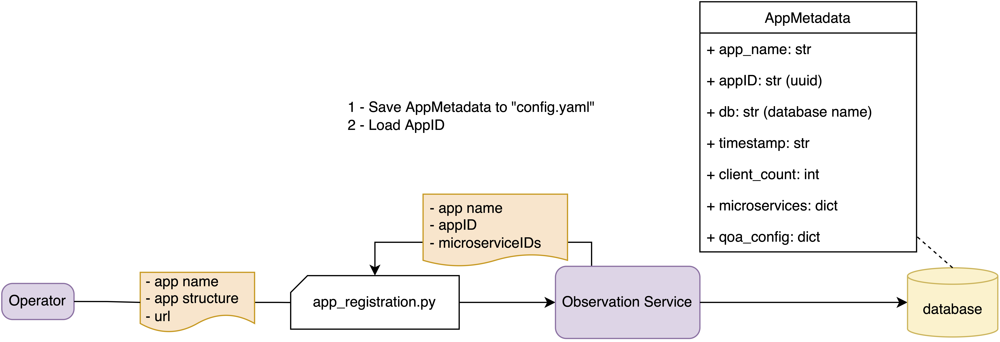
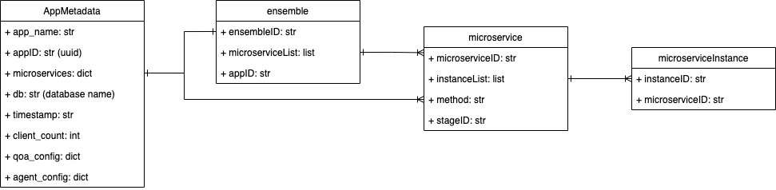

# ROHE

## High-level view


## Orchestration Module
## 1. Resource
The framework manage the infrastructure resource by Node; application by Deployment; network routine by Service; and eviroment variable by ConfigMap.
- Node: physical node
- Deployment: each application has multiple microservices. Each service has its own Deployment setup specify: image, resource requirement, replicas, etc
- Service: each microservice is advertized with a service name within K3s network so that other services can communicate with it.
- ConfigMap: provide initial environment variable for docker containers of each deployment when starting.

## 2. Algorithm
Sub-module:
- Selecting node for each deployment
- Profiling, categorizing microservices
- Elastic scaling


## ROHE deployment & management

### Deploy ROHE
Pre-deployment:
- mongoDb: connection
- message broker: connection (amqp - rabbitmq)
- Prometheus, Graphana (optional)

Edit "config/rohe.yaml" if needed and set ROHE_DIR to the /path/to/ROHE_ROOT
```
$export ROHE_DIR=`pwd`
```

Step 1:
- Edit configuration: 
    - Observation configuration: mongodb, message broker: example
    - Orchestration configuration

Step 2: 
- Start Observation service. Assume that you are in the ROHE_ROOT:
```
 $export PYTHONPATH=`pwd`
 $python core/observation/roheObservationService.py --conf config/observationConfig.yaml
```
    - Run start_observation: file -> url

Step 3:
- Start Ochestartion 
    - Run start_orchestartion: file -> url

### ROHE management
- function: example


## User running pipeline 
Assume user has application 
Explain:
- application: meaning
- client: meaning 
- ...


### Scenario 1: obsersvation
Step 1: 
- Registrate application: one time
    - template file for registrate: example 
    - Run client_registrate -> url: "obervation:register/" 
    return: qoa4ml config

Step 2:
- Enable monitoring: one time
    - Config qoa4ml client using qoa4ml config: example
    - Run: qoa4ml_configurate -> generate qoa4ml client config

Step 3: 
- Start observation agent
    - Set function and parser for agent in configuration.json: example: niiStream.config
    - Run start_agent: example: startAgent.sh -> python

Step 4
- Get analysis result from agent: 
    - get data from mogodb 

### Scenario 2: orchestration
### Scenario 3: ...

Add example contract to 'example/contract' 

rename module for icsoc, journal

### Scenario 4: user modify pipeline to use ROHE


## Implementation

### Application Registration

<figure>
<p style="text-align:center">

</p>
<figcaption>
<p style="text-align:center">
Fig. Application registration
</p>
</figcaption>
</figure>

### Observation Agent Management
<figure>
<p style="text-align:center">

</p>
<figcaption>
<p style="text-align:center">
Fig. Start/Stop observation agent
</p>
</figcaption>
</figure>


### Monitoring Metric
<figure>
<p style="text-align:center">

</p>
<figcaption>
<p style="text-align:center">
Fig. Monitoring metric from microservices
</p>
</figcaption>
</figure>
### Application Metadata Structure
<figure>
<p style="text-align:center">

</p>
<figcaption>
<p style="text-align:center">
Fig. Application metadata structure
</p>
</figcaption>
</figure>