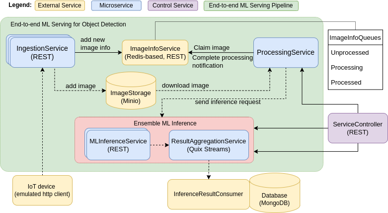

# Object Detection Pipeline

## Overview
This document provides a comprehensive overview of our end-to-end Machine Learning (ML) Serving Pipeline for Object Detection. The pipeline is designed to process images from ingestion to the aggregating service. Below is a step-by-step explanation of the flow and architecture, including each service's role in the process.

## Pipeline Flow and Architecture

The pipeline consists of several services that work together to process images for object detection:

- **IngestionService**: Serves as the entry point for images into the pipeline (via REST server)
- **ImageInfoService**: Functions as a centralized task queue for image processing jobs. It maintains a list of images that need to be processed, which the ProcessingService queries actively.
- **ProcessingService**: Responsible for image processing tasks, preparing them for inference.
- **MLInferenceService**: Performs the object detection inference using machine learning models.
- **ResultAggregationService**: Aggregates the results from the MLInferenceService and send them to the final destination (database in this case)
- **ServiceController**: Manages and controls the ML models and configuration settings for ProcessingService, MLInferenceService, and ResultAggregationService.

## Services Breakdown

### IngestionService
- **Input**: Images from IoT devices.
- **Output**: Image metadata and storage.

### ProcessingService
- **Input**: Image metadata.
- **Output**: Processed images ready for ML inference.

### MLInferenceService
- **Input**: Processed images.
- **Output**: Inference results.

### ResultAggregationService
- **Input**: Inference results.
- **Output**: Aggregated data for consumption.

## Running the Pipeline

Instructions on how to deploy and run the entire pipeline or individual services can be found in the links below.

### 1. Ingestion Service
Detailed steps for setting up and running the Ingestion Service can be found here:
[Ingestion Service README](./kube_deployment/dataIngestionService/README.md)

### 2. Processing Service
For guidelines on the Processing Service, refer to the following documentation:
[Processing Service README](./kube_deployment/dataProcessingService/README.md)

### 3. Inference Service
To run the Inference Service, follow the instructions outlined here:
[Inference Service README](./kube_deployment/inferenceService/README.md)

### 4. Aggregation Service
Information on how to aggregate results is available at this location:
[Aggregation Service README](./kube_deployment/aggregatingService/README.md)

## Additional Resources

- **Authors**
- **License** 
